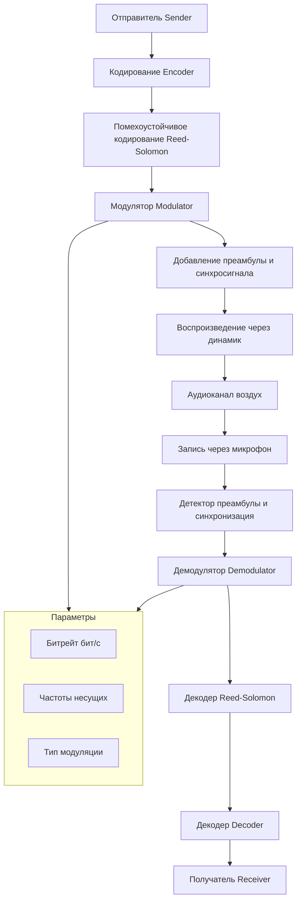

# План подготовки к задаче "Аудио-модем для передачи данных через звук"

## Анализ задачи

**Суть**: Разработать софт-модем (software-defined modem), который передаёт цифровые данные через аудиоканал (динамик → микрофон), когда недоступны WiFi, Bluetooth, NFC, интернет.

**Критерии оценки**:
1. Эффективность передачи данных (скорость, битрейт)
2. Устойчивость к внешним воздействиям (шум, расстояние, помехи)
3. Качество реализации (архитектура, код, документация)

## Стратегия на победу (ТОП 1)

### Ключевые решения для максимального результата:

#### 1. Многорежимная модуляция (Multi-Mode Adaptive Modem)
- **FSK (Frequency Shift Keying)** — базовый режим, 50-300 бит/с, максимальная помехоустойчивость
- **M-FSK** — несколько частот, 300-1200 бит/с
- **OFDM (Orthogonal Frequency Division Multiplexing)** — до 48 кбит/с, как в ADSL/VDSL
- **Адаптивный выбор режима** — автоматически подбирает скорость под качество канала

#### 2. Интеллектуальное кодирование
- **Преамбула для синхронизации** — chirp-сигнал + корреляционный детектор
- **Reed-Solomon FEC** — исправление пакетов ошибок
- **CRC-32/CRC-16** — проверка целостности
- **Interleaving** — перемежение битов против burst-ошибок

#### 3. Помехоустойчивость
- **Goertzel-алгоритм** для детекции тонов в шуме
- **Адаптивный порог** — динамическая подстройка под уровень шума
- **Многократная передача с мажоритарным декодированием** (для критичных данных)

#### 4. Стек технологий
- **Python + numpy + scipy.signal** — ядро DSP
- **sounddevice** — запись/воспроизведение аудио (PortAudio)
- **matplotlib** — визуализация спектрограмм для отладки
- **Typer/Click** — CLI интерфейс
- **Web Audio API** (опционально) — для браузерной демки

## Какие MCP серверы понадобятся

### Уже есть (настроены):

| MCP сервер | Назначение |
|---|---|
| [`desktop-commander`](c:/Users/Dimap/AppData/Roaming/Code/User/globalStorage/saoudrizwan.claude-dev/settings/cline_mcp_settings.json) | Запуск команд, управление файлами, редактирование кода |
| [`mcp-filesystem`](c:/Users/Dimap/AppData/Roaming/Code/User/globalStorage/saoudrizwan.claude-dev/settings/cline_mcp_settings.json) | Работа с файловой системой |
| [`mcp-git`](c:/Users/Dimap/AppData/Roaming/Code/User/globalStorage/saoudrizwan.claude-dev/settings/cline_mcp_settings.json) | Версионирование кода, git flow |
| [`mcp-memory`](c:/Users/Dimap/AppData/Roaming/Code/User/globalStorage/saoudrizwan.claude-dev/settings/cline_mcp_settings.json) | Хранение знаний в графовой БД (архитектура, алгоритмы) |
| [`mcp-sequential-thinking`](c:/Users/Dimap/AppData/Roaming/Code/User/globalStorage/saoudrizwan.claude-dev/settings/cline_mcp_settings.json) | Пошаговое рассуждение для сложных алгоритмов DSP |
| [`mcp-time`](c:/Users/Dimap/AppData/Roaming/Code/User/globalStorage/saoudrizwan.claude-dev/settings/cline_mcp_settings.json) | Работа с временными зонами (для логов) |
| [`mcp-fetch`](c:/Users/Dimap/AppData/Roaming/Code/User/globalStorage/saoudrizwan.claude-dev/settings/cline_mcp_settings.json) | Поиск документации/примеров кода |

### Нужно добавить:

| MCP сервер | Зачем | Установка |
|---|---|---|
| **`sox-mcp`** (SoX wrapper) | Обработка аудиофайлов: конвертация, обрезка, наложение эффектов, генерация тестовых тонов | `npx bingo-tango/sox-mcp` |
| **`audio-processing-mcp`** | Анализ аудио: спектр, BPM, RMS, частотные характеристики | Через pip + PyTorch |
| **`gr-mcp`** (GNU Radio) | Визуальное проектирование flowgraph DSP, симуляция канала с шумами | Требует GNU Radio + `npx Dollarhyde/gr-mcp` |

### Python зависимости (pip install):

| Пакет | Зачем |
|---|---|
| `numpy` | Математика, массивы, FFT |
| `scipy` | scipy.signal — фильтры, спектрограммы, оконные функции |
| `sounddevice` | Запись и воспроизведение звука (PortAudio) |
| `soundfile` | Чтение/запись WAV файлов |
| `matplotlib` | Визуализация спектрограмм, отладка |
| `pyserial` | Опционально: передача через UART как альтернатива |
| `pyaudio` | Запасной вариант для звука |
| `amodem` | Референсная реализация OFDM-модема на Python |
| `fskmodem` | Референсная реализация AFSK-модема |

## Архитектура решения

## План действий (Todos)

### Фаза 1: Подготовка инфраструктуры
1. Установить Python пакеты: `numpy`, `scipy`, `sounddevice`, `soundfile`, `matplotlib`, `amodem`, `pyserial`
2. Настроить MCP сервер `sox-mcp` (аудио обработка через SoX)
3. Исследовать и добавить `audio-processing-mcp` для продвинутого анализа аудио
4. Проверить что все MCP серверы корректно подключаются

### Фаза 2: Исследование и прототипирование
1. Запустить `amodem` как референс — протестировать send/recv через файл PCM
2. Создать тестовый стенд: передача через аудиокабель/динамик-микрофон
3. Написать базовый FSK модулятор/демодулятор на Python + numpy
4. Визуализировать спектрограммы через matplotlib — проверить корректность

### Фаза 3: Разработка основного решения
1. Реализовать кодирование: байты → биты → преамбула + данные + CRC
2. Реализовать FSK модуляцию: синусоиды на 2 частотах, fade-in/out
3. Реализовать FSK демодуляцию: Goertzel/FFT + detection + синхронизация
4. Реализовать OFDM: несколько несущих, QAM, пилот-сигналы
5. Добавить Reed-Solomon FEC
6. CLI интерфейс (typer/click)

### Фаза 4: Оптимизация и тестирование
1. Измерить BER (Bit Error Rate) при разных SNR
2. Тест на расстоянии: 1м, 5м, 10м
3. Тест с помехами: музыка, шум, разговор
4. Адаптивный выбор режима скорости
5. Документация и демонстрация

## Ожидаемые характеристики

| Параметр | FSK режим | OFDM режим |
|---|---|---|
| Скорость | 50-300 бит/с | 1-48 кбит/с |
| Дальность | до 15-20 м | до 5-10 м |
| Устойчивость к шуму | Высокая | Средняя |
| Частотный диапазон | 1-4 кГц | 2-11 кГц |
